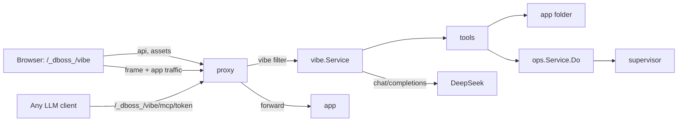

# Vibe: an AI harness on any dboss app

> Status: layers 1-4 implemented (see Build order); layer 5 is future work.

## Goal

Any dboss app can turn on a harness at a dedicated path on its own host: `https://<app host>/_dboss_/vibe`.
The page shows the app in a frame, a chat on the left and the actions a vibe coder needs on top: restart, commit, push.
The path has its own password, so the app itself can stay public while only the owner gets into the harness.

The built-in chat is an agent that edits the app through a fixed tool set and talks to DeepSeek only.
The same tool set is served over MCP under the same path, so the owner can work with any LLM client.
An **AI handover** button copies a prompt that gets any agent productive on this app in one paste.

## Scope of the first layer

* One harness per web process that turns it on, one chat per harness.
* Works in a host session and in a dev session, over https and plain http alike.
* DeepSeek only for the built-in chat, no provider abstraction.
  The wire format is OpenAI-compatible, so a second provider later is a base URL and a key, not a redesign.
* MCP over Streamable HTTP, tools only.

## Config

```yaml
# <app>/dboss.yaml, or dboss.local.yaml on the box
deepseek_api_key: $DEEPSEEK_API_KEY     # optional, wins over the host's defaults.deepseek_api_key
procfile:
  web:
    command: bundle exec puma
    host_prefix: www
    vibe:
      password: $VIBE_PASSWORD      # plain or a bcrypt hash from `dboss password`
  worker: bundle exec sidekiq
```

```yaml
# host dboss.local.yaml on the box
defaults:
  deepseek_api_key: sk-...              # every app without its own key uses this one
```

* `vibe` is a procfile entry option, like `pubsub`, `password` and `health`: the web process that declares it owns the harness on its own hosts.
  There is no top-level or `web` vibe key, the same rule `pubsub` follows.
* `vibe` on an entry that is not a web process (no `hosts`, no `host_prefix`) fails `dboss check`: a worker has no host to serve the page on.
* No `vibe` on a web process, no harness there: `/_dboss_/vibe` on its hosts falls through to the app like any other path.
  An app with two web processes (say `web` and `admin`) can turn it on for one only, and each one that has it gets its own harness, chat and MCP token.
* The DeepSeek key is the plain app key `deepseek_api_key`, in the `web` block's scope (`both`), so a host sets it for every app through `defaults.deepseek_api_key` and an app's own value wins, the way every other app key already inherits.
  Unset means the built-in chat is off.
  A key in `defaults` turns nothing on by itself, unlike a `vibe` block would; every vibe process of the app uses the app's resolved key.
  A dev session has no host file, so there it is the app's top-level key only.
  The literal key belongs in `dboss.local.yaml` (never deployed, never committed), or the committed file says `$DEEPSEEK_API_KEY`.
* `vibe.password` is required in a host session; `dboss check` fails without it, because the `run` tool makes the harness a shell on the box.
  A dev session may leave it empty: its proxy is local.
* New keys in `keySpecs` and `reference.yaml`: `vibe` and `vibe.password` as per-process procfile options (the password secret), and `deepseek_api_key` (app and `defaults`, secret).
  `deepseek_api_key` rides `Snapshot.Web`, like `alerts`.
  `resolveVibe` resolves it onto the runtime `config.WebProcess.Vibe`, next to `resolvePubsub`, so it rides `Snapshot.WebProcesses` and the proxy finds it through `Snapshot.WebForHost`.
* `/_dboss_/` becomes a reserved prefix on every app host, next to `/.well-known/dboss/`.
  Only `vibe` lives there for now.

## Paths

| Path | What answers |
| --- | --- |
| `/_dboss_/vibe` | sign-in page until the vibe session cookie is set, then the harness page |
| `/_dboss_/vibe/login`, `/_dboss_/vibe/logout` | the password check and sign-out |
| `/_dboss_/vibe/assets/*` | embedded harness assets; `assets/console/*` is the console's fez runtime, formatters, marked and app.css |
| `/_dboss_/vibe/api/*` | harness API (session cookie) |
| `/_dboss_/vibe/mcp/<token>` | MCP endpoint (its own token, no cookie) |
| everything else | the app, as today |

* The proxy matches the request host with `Snapshot.WebForHost`; the harness answers only when that web process has `vibe`.
* The harness frame loads `/` (or `?path=/cart` from the harness URL) on the same host, so the frame and the harness share the process's origin and the frame always shows the process that owns the harness.
* The harness keeps its own URL in sync with the frame (`/_dboss_/vibe?path=/cart` via `history.replaceState`; it can read the frame's location because it is the same origin), so reload and a shared link land on the same page.

## Sign-in

* The `vibe` filter sits before `signIn` and `passwordGate` in the proxy pipeline.
* `/_dboss_/vibe` without a session renders a `vibe_password` page through `./internal/pages` (so an app's custom `template.html` styles it), posting to `/_dboss_/vibe/login`.
* The check reuses what the `password` gate already has: `secretMatches`, the shared `throttle.Throttle` keyed by `httpx.ClientIP`, and `authcog.Flow.SetSession` with the audience `vibe:<app>/<process>:<digest of the password>`, so changing the password signs everyone out.
  The cookie is `dboss_vibe`, `HttpOnly`, `SameSite=Strict`, lasting `session_ttl`.
* A valid vibe session satisfies the app's own `password`, `basic_auth` and `auth` gates (like `AuthorizesPublish` does for pubsub), so the owner signs in once and the framed app opens even when the app is gated.
* **Sign out** in the harness clears the cookie.

## Frame headers

* An app that sends `X-Frame-Options: DENY` or CSP `frame-ancestors 'none'` would blank the frame.
* For requests that carry a valid vibe session, the proxy drops both headers from the app's response.
  Public visitors carry no session, so the app's headers reach them unchanged.

## Same-origin trade-off

The harness and the app share an origin, so script running in an app page can call the harness API from the owner's browser.
An XSS in the app, opened by the owner while signed in to the harness, could drive the agent and its `run` tool.
That is acceptable on a dedicated or staging app and on the owner's own code; on a public production app it is a real risk.

* The harness API refuses any request whose `Origin` is not the app's own, and every POST needs the `X-Dboss-Vibe: 1` header, which closes cross-site CSRF but not same-origin script.
* The README and the Help page say: put `vibe` on a dedicated checkout (`shop-vibe` on a staging box, behind `password`) when the app serves real users.

## Page layout

```
+------------------------------------------------------------------------------------+
| shop  /cart________ [reload] [open]  3 changed   [Restart] [Commit] [Push 2] [AI handover] [Sign out] |
+-----------------------------+------------------------------------------------------+
| chat                        |                                                      |
|  you: make the header blue  |                                                      |
|  agent: reading layout.erb  |                 <iframe> /cart                       |
|   > read_file layout.erb    |                                                      |
|   > edit_file app.css       |                                                      |
|   > http_get /cart  200     |                                                      |
|  agent: done, reloaded      |                                                      |
|                             |                                                      |
| [ message................ ] |                                                      |
| [Send] [Stop] [New chat]    |                                                      |
+-----------------------------+------------------------------------------------------+
```

* **Path bar**: the frame's path, editable, Enter navigates, reload next to it.
  The title shows `app/process` when the app has more than one web process.
* **Changed count**: `git status --porcelain` line count, refreshed after every turn and every action.
  Clicking it opens the **Changes** tab.
* **Restart**: the audited `restart` action (a roll on a host), then the frame reloads once the app serves again.
* **Commit**: a dialog with a message field, prefilled from the diff by DeepSeek when the key is set.
  Runs `git add -A` and `git commit`; ignored files stay out.
* **Push**: `git push` to the tracking remote with `tokens.github` through `git.AuthEnv`; refused with a clear message without an upstream.
  Shows the ahead count.
  When the app pins `branch`, push refuses any other branch, like the pull hook does.
* **AI handover**: copies the handover prompt and toasts it.
* **Open** (the icon next to reload): the frame's path in a new tab.
* Chat: each tool call is one collapsed line (name plus path or command), expandable to its result.
  **Stop** cancels a running turn, **New chat** clears the transcript.
  Without `deepseek_api_key` the panel says how to set it and points at AI handover.
* The left panel can be collapsed, so the frame takes the full width.

## Changes tab

The left panel has two tabs: **Chat** and **Changes (3)**.
It shows what the agent and anyone else changed; its one write is **Reset all**, and Commit and Push stay on the top bar.

```
+-----------------------------+------------------------------------------------------+
| [Chat] [Changes 3]   [ref]  |                                                      |
|                             |                                                      |
| Uncommitted  +42 -7 [Reset] |  app/views/layout.erb                     M  +12 -3  |
|  M app/views/layout.erb     |  @@ -10,7 +10,9 @@ <head>                            |
|  M public/app.css     +28 -4|    <title><%= title %></title>                       |
|  ? app/views/cart.erb  +2   | -  <header class="top">                              |
|                             | +  <header class="top top-blue">                     |
| Unpushed (2)                | +    <a href="/cart">Cart</a>                        |
|  a1b2c3d blue header   2m   |    </header>                                         |
|  9f8e7d6 add cart page 14m  |                                                      |
|                             |  [Back to preview]                                   |
+-----------------------------+------------------------------------------------------+
```

* **Uncommitted**: one row per file with its status letter (`M` modified, `A` added, `D` deleted, `R` renamed, `?` untracked) and `+added -removed` line counts, plus the totals in the section header.
* **Unpushed**: the commits ahead of the tracking remote (`@{u}..HEAD`), each with short sha, subject and age; clicking one lists its files, and a file opens that commit's diff of it.
  Hidden without an upstream.
* Clicking a file shows its unified diff in the right pane in place of the frame, with added and removed lines colored and line numbers on both sides; **Back to preview** (or Esc) returns to the frame.
  An untracked file shows as all added, a deleted one as all removed, a binary or oversized file (over 200 KB of diff) as one line saying so.
* The list refreshes on the `git` SSE event, which already fires after every turn, every action and every external MCP write, and on the refresh button; nothing polls.
* In the chat, a `write_file` or `edit_file` line links to that file's diff, so a reviewer goes from "the agent edited app.css" to the change in one click.
* **Reset all** (red, in the Uncommitted header, disabled with nothing to reset or while a chat turn runs) throws away every uncommitted change, untracked files included, and returns the folder to `HEAD`.
  * A confirmation dialog lists the files and their counts, and the button reads `Reset 3 files`.
  * It is recoverable: instead of `git reset --hard` plus `git clean`, it runs `git stash push --include-untracked --message 'dboss vibe: reset <time>'`, the same move the `branch` step makes.
    The work tree ends up identical, and the toast names the stash (`Saved as stash@{0}`), so `git stash pop` brings it back.
  * Ignored files (`.env`, `node_modules`, `tmp/`, uploads) are never touched.
  * Commits are never touched: unpushed commits stay, Reset only clears what Commit would take.
  * Afterwards the frame reloads; it does not restart the app, the top bar's Restart is one click away when the change needs it.
  * It is the audited `git-reset` ops action (`app`), with a spec like `git-commit`.
  * It is not an agent tool, in the chat or over MCP: like Push, throwing work away is the owner's button.
* Discarding a single file is not in this layer; a later layer adds a per-file **Discard** on the same stash-based path.

## Architecture



`./internal/vibe` follows the `pubsub` pattern: a `module.Module` built in `daemon.Build`, served by `Service.Filter` as a proxy extra stage, plus `Service.Authorizes` for the gate bypass.

* **Filter** (`filter.go`): captures `/_dboss_/vibe*` for apps with `vibe` on, sign-in, MCP, API, assets; drops the frame headers for signed-in requests.
* **Tools** (`tools.go`): the one registry the agent and MCP both call.
  A tool is a name, a JSON schema, a description and a Go function; the DeepSeek `tools` array and MCP `tools/list` both render from it.
* **Agent** (`agent.go`, `deepseek.go`): send transcript plus tools, stream the answer, run every tool call, append the results, repeat until an answer without a tool call or the step cap.
* **Transcript** (`chat.go`): one conversation per web process in `dir/state/<app>/vibe-<process>.json` through `fsutil.WriteJSON`, so a reload or a daemon restart keeps it.
* **Harness UI** (`static/`): embedded, built with fez like the console, sharing the console's vendored `fez.min.js` and its `app.css` tokens.

## Tools

Every path is relative to the app folder and resolved with symlinks followed; anything outside the folder, inside `.git/` or inside the runtime `dir` is refused.

| Tool | What it does | Backed by |
| --- | --- | --- |
| `app_info` | name, folder, URLs, processes and state, branch, dirty count | `ops.Service.App` |
| `list_files` | tracked plus untracked-not-ignored files, optional glob, capped | `git ls-files -co --exclude-standard` |
| `read_file` | content with line numbers, `offset`/`limit` | os |
| `write_file` | create or replace a file | `fsutil.WriteFile` |
| `edit_file` | exact `old` -> `new`, refused unless `old` matches once | os |
| `search` | regex over the file list, capped matches | `rg` when on PATH, else a Go walk |
| `run` | shell command in the app folder with the app's env, timeout capped at 5m | `ops` `exec` (`Manager.Exec`) |
| `restart` | restart the app or one process, wait until serving | `ops` `restart` |
| `logs` | recent stdout and log rows, optional query and process | `ops` `log-search` |
| `exceptions` | unresolved exception groups with the last dump | `ops.Service.Exceptions` |
| `http_get` | GET a path on the app, status plus a capped body | an internal request through the app proxy |
| `git_status` | porcelain status plus a capped diff | git |
| `commit` | `git add -A` plus `git commit -m` | `ops` `git-commit` |

* Every result is capped (20k chars) with a note on how much was cut.
* `push` is deliberately not a tool: publishing is the owner's button.
* New ops actions `git-commit` (`app`, `message`), `git-push` (`app`) and `git-reset` (`app`), audited through `Do` with the actor `vibe:<app>/<process>` (harness) or `mcp:<app>/<process>` (MCP), with specs so the HTTP API and CLI get them too.
  The git calls go in `./internal/git/worktree.go`: `Status` (`git status --porcelain=v2 -z` plus `git diff --numstat HEAD`), `Unpushed` (`git log @{u}..HEAD`), `Diff`, `Commit`, `Push`, `Reset` (the stash, returning its name).
  Every path is passed after `--`, so a file name can never read as a flag.
* Commit author: the repository's own git identity, else `dboss vibe <vibe@<first host>>`.
* Every changing tool call, from the chat or MCP, writes one audit row (`vibe-write`/`vibe-edit` with the path, `exec` with the command, `restart`, `git-commit`), so the console's Audit page shows what any agent did.

## Built-in chat (DeepSeek)

* Key from the app's resolved `deepseek_api_key`, read per turn from the snapshot, so a `dboss rescan` picks up a change in the app file or in `defaults`.
* `GET state` reports only whether a key is set, never the key itself.
* `https://api.deepseek.com/chat/completions`, model `deepseek-chat`, `stream: true`, `tools` from the registry; both constants in `deepseek.go`.
* System prompt, rebuilt per turn: the agent's role and tool rules, the app's `dboss.yaml`, `AGENTS.md`/`CLAUDE.md`/`README.md` when present (capped), the file list (capped), the app state.
* Limits: 40 tool steps and 5 minutes per turn; Stop cancels the context and kills a running `run`.
* One turn at a time; a second `chat` POST is refused while one runs.
* No compaction in this layer: near the window the oldest tool results become one-line stubs, **New chat** is the reset.
* After a turn that wrote files the frame reloads; after a `restart` call the reload waits for it.

## Harness API

Under `/_dboss_/vibe/api/`, vibe session cookie, same-origin `Origin`, `X-Dboss-Vibe: 1` on every POST.

* `GET state` - URLs, key present, transcript, running turn, git status, MCP URL.
* `POST chat` `{message}`, `POST stop`, `POST new` (a new chat).
* `GET events` - SSE: `delta`, `tool_call`, `tool_result`, `turn_done`, `git`, `external`.
  A new subscriber gets the running turn replayed first, so a reload mid-turn catches up.
* `GET changes` - uncommitted files (path, old path for a rename, status, additions, deletions) and unpushed commits (sha, subject, author, time, files).
* `GET diff?path=` - the working-tree diff of one file against `HEAD`; `GET diff?commit=&path=` - one file in one unpushed commit.
  `path` must be one the `changes` answer listed and `commit` a hex sha among the unpushed ones, so the endpoint never becomes a general file or history reader.
* `POST restart`, `POST commit` `{message}`, `POST push`, `POST reset`, `POST commit-message`.
* `GET handover` - the prompt text.
* `POST mcp-rotate` - new MCP token.
* `POST logout`.

## MCP

* Endpoint `<app url>/_dboss_/vibe/mcp/<token>`, Streamable HTTP, tools only.
* The token is in the path, so clients that cannot set headers (web chat connectors) work too; an `Authorization: Bearer` header is accepted as well.
  Every check goes through `throttle.Throttle` and a constant-time compare, like `checkToken`.
* The token is generated per `(app, process)`, like a pubsub secret, and kept in `secret.Store` (`dir/state/vibe-secrets.json`), rotated from the harness.
  `secret` stops being pubsub-only; AGENTS.md is updated.
* Library: the official `github.com/modelcontextprotocol/go-sdk`, pure Go, so `CGO_ENABLED=0` holds.
* On a host the app URL is public HTTPS, so remote clients reach it: claude.ai or ChatGPT connectors, Claude Code or Codex on the owner's laptop, an agent in CI.
  In a dev session only local clients can.
* Mutating MCP calls show up live in the harness chat as `external: <tool> <path>` and reload the frame on writes.

## AI handover prompt

Generated per click from live state.

```
You are working on the web app "<app>", served by dboss at <app url>.
The owner watches it live at <app url>/_dboss_/vibe.

Branch: <branch> (<n> uncommitted changes)
Stack hints: <first lines of README / detected package files>

Connect this MCP server; it is how you read and change the app:

  <app url>/_dboss_/vibe/mcp/<token>

Claude Code: claude mcp add --transport http <app> <app url>/_dboss_/vibe/mcp/<token>

Rules:
* Change files only through the MCP tools; the app runs on a server, not on your machine.
* After a change that needs it, call `restart`, then check `logs` and `exceptions`.
* Verify with `http_get` before you say a change works.
* Commit with a clear message when a change is done. Never push; the owner pushes.

Task: <empty, for the owner to fill in>
```

The prompt carries the token, so the toast says it grants full access to the app and Rotate revokes it.

## Files

```
+ ./internal/vibe/service.go       module, Ops seam, harness lookup
+ ./internal/vibe/harness.go       one chat: transcript, running turn, SSE subscribers
+ ./internal/vibe/filter.go        path capture, sign-in, gate bypass, frame headers, page and assets
+ ./internal/vibe/api.go           harness API, diff guard, event stream
+ ./internal/vibe/tools.go         tool registry, path confinement, result caps, audit
+ ./internal/vibe/httpget.go       http_get through the app proxy
+ ./internal/vibe/agent.go         chat loop, limits, context budget, system prompt, commit message
+ ./internal/vibe/deepseek.go      streaming chat/completions client
+ ./internal/vibe/mcp.go           MCP server over the registry, token check
+ ./internal/vibe/handover.go      handover prompt
+ ./internal/vibe/static/          index.html, vibe.css, vibe.js, fez/vibe-{app,chat,changes,diff,dialogs}.fez
+ ./internal/vibe/vibe_test.go     confinement, sign-in, gate bypass, tools, a turn against a fake DeepSeek, MCP, diff guard
+ ./internal/git/worktree.go       Status, Diff, CommitDiff, CommitAll, Push, Reset
+ ./internal/ops/git.go            git-commit, git-push, git-reset
~ ./internal/config/               procfile vibe option, resolveVibe, WebProcess.Vibe, deepseek_api_key, vibe block, reference.yaml, $NAME in procfile secrets
~ ./internal/pages/                vibe_password page spec
~ ./internal/proxy/                proxy.Modules: Early stages, Authorizers, Responses
~ ./internal/secret/               vibe tokens, Matches (moved from the proxy)
~ ./internal/daemon/daemon.go      build and register vibe.Service, wire it into the proxy
~ ./internal/console/              Assets() for the harness, Help tab Vibe page
~ ./demo/apps/bun/dboss.yaml       vibe on the web process, password "vibe"
~ ./e2e/vibe_test.go               sign-in, harness page, state, MCP tools/list, read_file, http_get, an escaping path
~ README.md, AGENTS.md
```

## Build order

Each step ships something that works on its own.

1. **Harness shell**: `vibe` block and checks, the filter, sign-in, gate bypass, frame headers, path bar, Restart, changed count.
2. **Changes, Reset, Commit and Push**: the Changes tab with diffs, Reset all, the git ops actions, commit dialog, ahead count.
3. **Tools plus MCP plus handover**: registry, MCP endpoint, token, rotate, handover button, `external` events.
   At this point any LLM client can vibe code the app.
4. **Built-in DeepSeek chat**: agent loop, SSE, transcript, Stop, New chat, generated commit message.
5. Later layers, not in this plan: a `vibe.wrap` option that opens every top-level navigation in the harness (via `Sec-Fetch-Dest`, https only), a vibe checkbox in Add app, several chats, frame screenshots for the agent, more providers, per-turn file snapshots.

## Decisions taken (change any before building)

* **Dedicated path on any web process**, `/_dboss_/vibe`, turned on by `procfile.<process>.vibe`, the same place `pubsub` and `password` live; no console page and no separate port.
* **Own password for the path**, independent of the app's gates; a vibe session passes the app's gates so the frame opens.
* **Same origin for harness and app**, with the XSS trade-off documented in the reference, README and Help page.
* **DeepSeek key is one plain key, `deepseek_api_key`**: per app at the top level, per server in `defaults.deepseek_api_key`; no `tokens` entry and no key inside `vibe`.
* **MCP token in the URL path**, rotatable, so every client kind can connect.
* **Push and Reset are never agent tools**, in the chat or over MCP.
* **Reset is a stash**, not `reset --hard`, so a misclick is one `git stash pop` away.
* **`run` is a tool**; without it the agent cannot install, migrate or test.
* **Official MCP Go SDK** over a hand-rolled JSON-RPC server.
* **One persisted chat per web process**, no history list; git is the undo.
